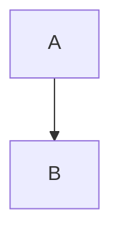

# Markdown Mermaid Specification

## Overview

A lightweight, no-frills application for viewing Markdown files with integrated Mermaid diagram rendering support, built with Kotlin Multiplatform.

---

## Core Features

### 1. File Operations
- **Open local files**: Open `.md` and `.markdown` files via:
  - File menu (desktop)
  - Drag and drop onto application window (desktop)
  - Command line argument (`markdownviewer path/to/file.md`) (desktop)
  - System share sheet / file picker (mobile)
- **Open from URL**: Fetch and render markdown from a remote URL:
  - URL input field / dialog
  - Command line argument (`markdownviewer https://example.com/README.md`) (desktop)
  - Deep link / intent handling (mobile)
  - Support for common raw content URLs (GitHub raw, GitLab raw, etc.)
- **Recent files/URLs**: Track last 10 opened items (local files and URLs)
- **Watch for changes**: Auto-reload when the file changes on disk (desktop only, local files, optional toggle)
- **Refresh URL**: Manual refresh for URL-sourced content

### 2. URL Handling

| Feature | Description |
|---------|-------------|
| Supported protocols | `https://` (required), `http://` (with warning) |
| Content validation | Verify `Content-Type` is text/markdown or text/plain |
| Timeout | 30 second connection/read timeout |
| Max size | Reject files > 5MB |
| Caching | Cache fetched content locally for offline viewing (optional) |
| Error handling | Display clear error for network failures, 404s, timeouts |
| Relative links | Resolve relative image/link URLs against base URL |

**Example supported URLs:**
- `https://raw.githubusercontent.com/user/repo/main/README.md`
- `https://gitlab.com/user/repo/-/raw/main/docs/guide.md`
- `https://example.com/documentation.md`

### 3. Markdown Rendering

Support standard CommonMark specification plus GitHub Flavored Markdown (GFM) extensions:

| Feature | Syntax |
|---------|--------|
| Headings | `#` through `######` |
| Bold | `**text**` or `__text__` |
| Italic | `*text*` or `_text_` |
| Strikethrough | `~~text~~` |
| Inline code | `` `code` `` |
| Code blocks | Triple backticks with language hint |
| Blockquotes | `>` prefix |
| Ordered lists | `1.` prefix |
| Unordered lists | `-`, `*`, or `+` prefix |
| Task lists | `- [ ]` and `- [x]` |
| Tables | GFM pipe syntax |
| Links | `[text](url)` |
| Images | `` - render inline |
| Horizontal rules | `---`, `***`, or `___` |
| Autolinks | URLs and emails |

### 4. Syntax Highlighting

Code blocks with language hints receive syntax highlighting:
- Common languages: JavaScript, TypeScript, Python, Go, Rust, Java, Kotlin, C/C++, HTML, CSS, JSON, YAML, SQL, Bash, Markdown

### 5. Mermaid Diagram Support

Render Mermaid diagrams from fenced code blocks with `mermaid` language hint:

````

````

**Supported diagram types:**
- Flowcharts (`graph`, `flowchart`)
- Sequence diagrams
- Class diagrams
- State diagrams
- Entity Relationship diagrams
- Gantt charts
- Pie charts
- Git graphs

**Error handling:** Display error message inline if Mermaid syntax is invalid.

---

## Target Platforms

| Platform | UI Framework | Min Version |
|----------|--------------|-------------|
| Android | Compose Multiplatform | API 24 (Android 7.0) |
| iOS | Compose Multiplatform | iOS 14+ |
| macOS | Compose Multiplatform | macOS 11+ (Big Sur) |
| Windows | Compose Multiplatform | Windows 10+ |
| Linux | Compose Multiplatform | Ubuntu 20.04+ / equivalent |

---

## Platform Integration

### File Type Registration

The app registers as a handler for Markdown files on all platforms, allowing users to open `.md` and `.markdown` files directly from their file manager or other apps.

#### Android

Register intent filters in `AndroidManifest.xml`:

```xml
<activity android:name=".MainActivity">
    <!-- Open from file managers -->
    <intent-filter>
        <action android:name="android.intent.action.VIEW" />
        <category android:name="android.intent.category.DEFAULT" />
        <category android:name="android.intent.category.BROWSABLE" />
        <data android:mimeType="text/markdown" />
        <data android:mimeType="text/x-markdown" />
    </intent-filter>

    <!-- Open by file extension -->
    <intent-filter>
        <action android:name="android.intent.action.VIEW" />
        <category android:name="android.intent.category.DEFAULT" />
        <category android:name="android.intent.category.BROWSABLE" />
        <data android:scheme="file" />
        <data android:scheme="content" />
        <data android:host="*" />
        <data android:pathPattern=".*\\.md" />
        <data android:pathPattern=".*\\.markdown" />
    </intent-filter>

    <!-- Handle shared/sent files -->
    <intent-filter>
        <action android:name="android.intent.action.SEND" />
        <category android:name="android.intent.category.DEFAULT" />
        <data android:mimeType="text/markdown" />
        <data android:mimeType="text/x-markdown" />
        <data android:mimeType="text/plain" />
    </intent-filter>
</activity>
```

**Behavior:**
- App appears in "Open with" dialogs for markdown files
- App appears in share sheet when sharing markdown files
- Handle both `file://` and `content://` URIs (scoped storage)

#### iOS

Register document types in `Info.plist`:

```xml
<key>CFBundleDocumentTypes</key>
<array>
    <dict>
        <key>CFBundleTypeName</key>
        <string>Markdown Document</string>
        <key>CFBundleTypeRole</key>
        <string>Viewer</string>
        <key>LSHandlerRank</key>
        <string>Alternate</string>
        <key>LSItemContentTypes</key>
        <array>
            <string>net.daringfireball.markdown</string>
            <string>public.text</string>
        </array>
    </dict>
</array>

<key>UTImportedTypeDeclarations</key>
<array>
    <dict>
        <key>UTTypeIdentifier</key>
        <string>net.daringfireball.markdown</string>
        <key>UTTypeDescription</key>
        <string>Markdown Document</string>
        <key>UTTypeConformsTo</key>
        <array>
            <string>public.plain-text</string>
        </array>
        <key>UTTypeTagSpecification</key>
        <dict>
            <key>public.filename-extension</key>
            <array>
                <string>md</string>
                <string>markdown</string>
            </array>
            <key>public.mime-type</key>
            <array>
                <string>text/markdown</string>
                <string>text/x-markdown</string>
            </array>
        </dict>
    </dict>
</array>
```

**Behavior:**
- App appears in "Open In" menu for markdown files
- App appears in share sheet
- Files app integration for opening markdown documents
- Supports both iCloud and local files

#### Desktop (macOS, Windows, Linux)

| Platform | Registration Method |
|----------|---------------------|
| macOS | `Info.plist` CFBundleDocumentTypes (similar to iOS) + LaunchServices |
| Windows | Registry entries for `.md` and `.markdown` extensions during install |
| Linux | `.desktop` file with `MimeType=text/markdown;text/x-markdown;` |

---

## User Interface

### Desktop Layout
```
┌─────────────────────────────────────────┐
│ Menu Bar                                │
├─────────────────────────────────────────┤
│                                         │
│           Rendered Content              │
│           (scrollable)                  │
│                                         │
├─────────────────────────────────────────┤
│ Status Bar: filename/URL | line count   │
└─────────────────────────────────────────┘
```

### Mobile Layout
```
┌─────────────────────────────────────────┐
│ Top App Bar: Title | Menu               │
├─────────────────────────────────────────┤
│                                         │
│           Rendered Content              │
│           (scrollable)                  │
│                                         │
│                                         │
└─────────────────────────────────────────┘
```

### Menu/Actions
- **Open File** (desktop: Ctrl/Cmd+O, mobile: menu item)
- **Open URL** (desktop: Ctrl/Cmd+U, mobile: menu item)
- **Open Recent** (submenu/screen - shows both files and URLs)
- **Reload/Refresh** (desktop: Ctrl/Cmd+R, mobile: pull-to-refresh)
- **Zoom In/Out** (desktop: Ctrl/Cmd++/-, mobile: pinch gesture)
- **Toggle Auto-Reload** (desktop only, local files only)
- **About**

### Appearance
- Clean, minimal chrome
- Light and dark theme (follows system preference)
- **Primary color: Orange** (Material 3 color scheme derived from orange seed color)
- App icon: User-provided
- Material 3 design system
- Readable default typography:
  - Body: System sans-serif, 16sp base
  - Code: Monospace font (JetBrains Mono preferred)
  - Headings: Proportionally scaled
- Comfortable line height and margins
- Responsive content width (max ~800dp centered on large screens)
- Loading indicator for URL fetching

---

## Technical Architecture

### Project Structure
```
markdownviewer/
├── composeApp/
│   ├── commonMain/          # Shared UI & business logic
│   ├── androidMain/         # Android-specific code
│   ├── iosMain/             # iOS-specific code
│   ├── desktopMain/         # Desktop-specific code (JVM)
│   └── resources/           # Shared resources
├── shared/
│   └── commonMain/          # Pure Kotlin shared logic
├── build.gradle.kts
└── settings.gradle.kts
```

### Shared Code (commonMain)
- Markdown parsing and AST
- Mermaid diagram model
- Theme/styling definitions
- File handling abstractions
- URL fetching abstractions
- ViewModel/state management

### Platform-Specific (expect/actual)
| Feature | Android | iOS | Desktop |
|---------|---------|-----|---------|
| File picker | SAF/Intent | UIDocumentPicker | JFileChooser/AWT |
| File watching | FileObserver | DispatchSource | WatchService |
| HTTP client | Ktor/OkHttp | Ktor/URLSession | Ktor/Java HttpClient |
| Mermaid rendering | WebView | WKWebView | JavaFX WebView or JCEF |
| Drag & drop | N/A | N/A | AWT DnD |
| Deep links | Intent filters | URL schemes | CLI args |

### Dependencies

**Shared:**
- `org.jetbrains.compose` - Compose Multiplatform
- `com.mikepenz:multiplatform-markdown-renderer` - Markdown rendering in Compose
- `io.ktor:ktor-client` - Multiplatform HTTP client for URL fetching
- `org.jetbrains.kotlinx:kotlinx-coroutines` - Async operations
- `io.github.aakira:napier` - Multiplatform logging

**Mermaid Rendering Options:**
1. **WebView approach** (recommended): Embed Mermaid.js in a platform WebView
2. **Native SVG**: Parse Mermaid server-side or use a Kotlin Mermaid parser (limited)

**Syntax Highlighting:**
- `dev.snipme:highlights` - Kotlin Multiplatform syntax highlighting

### State Management
```kotlin
sealed class ContentSource {
    data class LocalFile(val path: String) : ContentSource()
    data class RemoteUrl(val url: String) : ContentSource()
}

data class ViewerState(
    val source: ContentSource?,
    val content: String,
    val isLoading: Boolean,
    val error: String?,
    val zoomLevel: Float,
    val autoReload: Boolean,
    val theme: Theme
)
```

---

## Performance Requirements

- Local files up to 1MB should render in under 1 second
- URL content should begin rendering within 2 seconds (network dependent)
- Smooth 60fps scrolling for documents up to 10,000 lines
- Lazy render Mermaid diagrams as they scroll into view
- Memory: < 200MB baseline on desktop, < 100MB on mobile

---

## Non-Functional Requirements

### Security
- Sanitize HTML to prevent XSS from malicious markdown
- HTTPS required for URL fetching (HTTP allowed with user warning)
- No execution of scripts from fetched content
- Mobile: Respect scoped storage/sandboxing
- Certificate validation for HTTPS connections

### Accessibility
- Keyboard navigation support (desktop)
- TalkBack/VoiceOver compatible
- Respect system font size preferences
- Sufficient color contrast (WCAG AA)

### Distribution
| Platform | Distribution |
|----------|--------------|
| Android | APK / Play Store |
| iOS | App Store |
| macOS | DMG / Mac App Store |
| Windows | MSI / MSIX installer |
| Linux | AppImage / Flatpak / DEB |

---

## Out of Scope

The following are explicitly **not** included:
- Editing capabilities
- Split view (source/preview)
- Export to PDF/HTML
- Printing
- Custom themes/CSS
- Plugin system
- Cloud sync or collaboration
- Web/WASM target
- Authentication for private URLs (GitHub tokens, etc.)

---

## Future Considerations

These may be added in later versions if needed:
- Table of contents sidebar/drawer
- Search within document
- Copy code block button
- Print support (desktop)
- Share content (mobile)
- Web/WASM target via Compose for Web
- GitHub/GitLab authentication for private repositories
- Offline cache management UI
- Bookmarks/favorites
